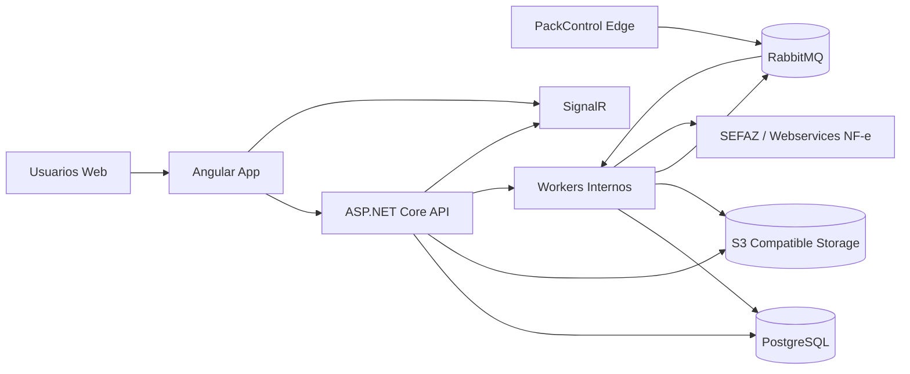

# SDS - PackControl

Versao: 0.3  
Data: 2026-03-27  
Status: Draft consolidado com checkpoint implementado e deploy tecnico referenciado no repositorio

## 1. Objetivo

Definir a arquitetura tecnica, o escopo do MVP, as fronteiras de modulo, os requisitos nao funcionais e a estrategia de entrega do PackControl, um ERP SaaS especializado para facarias com foco em operacao real, rastreabilidade, fiscal `NF-e` plugavel, financeiro funcional e integracao com chao de fabrica.

Este SDS consolida o material funcional do PRD e a revisao do wireframe e traduz essas definicoes para um desenho tecnico implementavel por um time enxuto composto por um desenvolvedor principal com apoio de IA.

Documentos de origem:
- `docs/prd-erp-facaria.md`
- `docs/wireframe-review-visily.md`

Documento complementar deste desenho:
- `docs/sds-modulo-fiscal-nfe.md`

## 1.1 Checkpoint implementado no repositorio

Estado observado em `2026-03-27`:
- SPA Angular operacional em PT-BR com modulos de clientes, ativos, produtos, transportadoras, cadastros, materiais, estoque, financeiro, configuracoes e producao;
- API ASP.NET Core com autenticacao por cookie, auditoria minima e persistencia configuravel em `InMemory` ou `PostgreSQL`;
- baseline de deploy tecnico em `deploy/`, com `Dockerfile` de `API`/frontend, `docker-compose.production.yml` e proxy `nginx`;
- endpoints `GET /health/live` e `GET /health/ready` para validacao operacional de `API`, persistencia e storage local;
- persistencia atual em `PostgreSQL` feita por snapshot `JSONB` em `public.app_state_snapshots`, com evolucao futura prevista para modelo relacional;
- storage atual em disco local para anexos, artefatos tecnicos e artefatos fiscais;
- parser real de `PDF` com `PdfPig` e analise real de `DXF` com `IxMilia.Dxf`;
- `split/merge` auditavel de OPs;
- emissao de `NF-e` por camada canonica com `prepare/issue`, onboarding do emitente, empresa emissora com readiness fiscal, templates de operacao, perfis `A1/A3`, snapshot congelado de emitente/destinatario/itens/totais/pagamento/transporte, arquivamento de `XML`/`DANFE`, roteamento de adapters por emitente e diagnostico real de status do servico via `Unimake.DFe`.

## 2. Escopo do produto

### 2.1 Escopo do MVP

O MVP vendavel do PackControl inclui:
- autenticacao, autorizacao e trilha de auditoria;
- cadastro de clientes, contatos e ativos tecnicos basicos;
- abertura de pedido com escopo flexivel;
- upload e historico de arquivos;
- analise tecnica imediata de `PDF` e `DXF`, com renderizacao quando aplicavel;
- estimativa deterministica de complexidade, tempo, gargalo e prazo;
- orcamento com preco sugerido e ajuste manual;
- pedido consolidado;
- geracao e acompanhamento de ordens de producao;
- filas operacionais por setor;
- materiais e estoque em nivel funcional;
- logistica e expedicao;
- financeiro funcional;
- fiscal plugavel com emissao de NF-e;
- integracao com um agente local de fabrica para eventos de corte/dobra.

### 2.2 Fora do MVP

Nao entram no MVP:
- multi-CNPJ operacional completo;
- patrimonio;
- BI gerencial avancado;
- regras fiscais multiempresa avancadas;
- automacao contabil/fiscal profunda alem do necessario para NF-e;
- alta disponibilidade multi-regiao;
- operacao offline completa do ERP web.

### 2.3 Premissas de negocio

Premissas aceitas neste draft:
- a facaria fatura predominantemente como produto;
- a emissao principal do MVP sera NF-e modelo 55;
- MDF-e fica previsto em arquitetura, mas sua entrega no MVP depende da confirmacao operacional da logistica propria;
- operadores nao visualizam custo, margem ou preco;
- o produto sera acessado via internet publica, com seguranca reforcada no login e segregacao de acesso por perfil.

## 3. Objetivos de arquitetura

- sustentar o fluxo ponta a ponta sem depender de ERP generico;
- permitir implementacao iterativa por um time enxuto;
- reduzir custo operacional da nuvem no inicio;
- manter alta rastreabilidade de pedidos, arquivos, OPs, movimentacoes e documentos fiscais;
- separar bem dominio comercial, producao, financeiro e fiscal;
- tratar integracoes fabris como borda assincrona e resiliente;
- permitir evolucao futura para multiempresa e fiscal mais amplo sem reescrever o core.

## 4. Principios tecnicos

- `modular monolith` como arquitetura principal;
- regras de negocio no backend; frontend rico, mas nao soberano;
- sincronismo por HTTP/REST onde o acoplamento e direto;
- realtime por `SignalR` apenas nas telas que realmente precisam;
- assincronia interna via `PostgreSQL outbox/inbox + BackgroundServices`;
- `RabbitMQ` restrito a borda industrial, ingestao externa e pipeline pesado de analise;
- armazenamento transacional em `PostgreSQL`;
- armazenamento de anexos e artefatos em `S3-compatible object storage`;
- seguranca por padrao: cookies `HttpOnly`, MFA para perfis sensiveis, auditoria e minimo privilegio;
- fiscal desacoplado por portas/adapters;
- edge agent simples, robusto e tolerante a falha de internet.

## 5. Visao de alto nivel

## 6. Stack alvo

### 6.1 Frontend

- `Angular` como SPA principal do produto;
- `Bootstrap` como base de layout, grid, forms e componentes visuais;
- `TypeScript` para toda a camada interativa;
- `SignalR client` para atualizacao em tempo real;
- `Angular Router`, guards e interceptors para autenticacao e autorizacao;
- componentes com foco em formularios grandes, tabelas operacionais, boards e filas.

Diretrizes de frontend:
- manter a identidade visual unificada entre telas gerenciais e operacionais;
- usar linguagem de cards, chips e foco em acao principal;
- suportar desktop e tablet nas filas operacionais;
- evitar replicar regra de negocio complexa no browser.

### 6.2 Backend

- `ASP.NET Core` em versao LTS;
- API REST para CRUD, consultas, operacoes de negocio e upload;
- `SignalR` para hubs de atualizacao operacional;
- `BackgroundService/IHostedService` para jobs internos;
- modulos internos em camadas `Domain`, `Application`, `Infrastructure` e `Presentation`.

### 6.3 Dados e infraestrutura

- `PostgreSQL` como banco principal, com implementacao atual baseada em snapshot e evolucao planejada para modelo relacional;
- `RabbitMQ` apenas para eventos de borda e pipeline de analise/ingestao;
- storage `S3-compatible` como alvo; implementacao atual usa disco local para anexos, `XML`, `DANFE` e derivados;
- logs estruturados centralizados;
- backup externo criptografado;
- deploy inicial em nuvem barata com topologia de baixo custo e restauracao rapida, usando o baseline de referencia versionado em `deploy/`.

## 7. Modulos de dominio

| Modulo | Responsabilidade principal | Observacoes |
|---|---|---|
| `Identity` | login, sessao, MFA, permissao, bloqueio, auditoria de acesso | base de seguranca do sistema |
| `Customers` | clientes, contatos, regras comerciais, score interno | score informativo, nao bloqueante |
| `Assets` | ativos tecnicos do cliente e historico | base para repeticao/reforma/adaptacao |
| `Orders` | pedido, escopo, classificacao, anexos e status | coracao comercial do sistema |
| `Files` | upload, versao, hash, vinculacao a pedido/ativo/OP | governa anexos e artefatos |
| `Technical Analysis` | ingestao, analise de `PDF`/`DXF`, render, score, extracao estruturada e historico | integra com pipeline deterministico e parser documental |
| `Estimator` | tempo previsto, capacidade, gargalo, prazo sugerido | separado da simples analise de arquivo |
| `Quotes` | preco sugerido, margem, ajuste manual, aprovacao | gera compromisso comercial |
| `Production` | OPs, split/merge, roteiros, filas, apontamentos | nucleo operacional |
| `Materials` | tipos tecnicos, materiais reais, saldos, reservas e custo | separa cadastro tecnico de estoque real |
| `Logistics` | expedicao, lote, checklist, comprovantes, ocorrencias | cobre coleta/entrega/retirada |
| `Finance` | contas a receber, contas a pagar, baixa, resultado basico | funcional, sem contabilidade completa |
| `Fiscal` | NF-e, XML, assinatura, autorizacao, cancelamento, inutilizacao, CC-e, DANFE | desenhado para adapter proprio e externo |
| `Notifications` | alertas internos, fila de tarefas e notificacoes de sistema | sem acoplar logica ao frontend |
| `Administration` | configuracoes, parametros do estimador, papeis e integracoes | materiais/estoque ficam fora deste modulo |
| `Audit` | trilha de auditoria transversal | leitura obrigatoria para acoes sensiveis |

## 8. Contextos e fronteiras

### 8.1 Core transacional

O core transacional e composto por:
- `Identity`
- `Customers`
- `Assets`
- `Orders`
- `Quotes`
- `Production`
- `Materials`
- `Logistics`
- `Finance`
- `Fiscal`
- `Administration`

Esse core usa `PostgreSQL` como fonte principal de verdade e comunica mudancas internas via outbox.

### 8.2 Core tecnico

O core tecnico e composto por:
- `Files`
- `Technical Analysis`
- `Estimator`

Esses modulos tratam arquivos tecnicos, extracao estruturada de PDFs, score de complexidade, render e insumos de estimativa.

### 8.3 Borda industrial

A borda industrial e composta por:
- `PackControl Edge`
- `RabbitMQ`
- consumidores internos de eventos fabris e analise

Seu papel e receber eventos do chao de fabrica, deduplicar, reter localmente quando necessario e publicar de forma confiavel para o backend.

## 9. Fluxos principais

### 9.1 Pedido para orcamento

1. Usuario cadastra ou seleciona cliente.
2. Usuario abre pedido com tipo (`novo`, `repeticao`, `manutencao`, `reforma`, `adaptacao`).
3. Usuario informa escopo inicial, mesmo sem arquivo.
4. Arquivos sao anexados ao pedido.
5. Sistema executa analise tecnica imediata para cada arquivo elegivel.
6. Em `PDF`, o sistema extrai campos estruturados e sinais tecnicos com confianca.
7. Em `DXF`, o sistema calcula metricas, score, materiais detectados e render.
8. O resultado pode preencher e sugerir dados do pedido.
9. Engenharia revisa e complementa o contexto tecnico.
10. Estimador calcula tempo, gargalo, prazo e custo base.
11. Orcamentista ajusta margem e preco final.
12. Cliente aprova.
13. Pedido segue para producao e faturamento.

### 9.2 Pedido para producao

1. Pedido aprovado gera uma ou mais OPs.
2. PCP define split/merge e setor inicial.
3. Filas por setor exibem responsavel, urgencia, prazo e apoio visual.
4. Apontamentos e eventos de fabrica alteram estado operacional.
5. Logistica recebe itens concluidos e monta lote de saida.

### 9.3 Pedido para financeiro/fiscal

1. Pedido aprovado gera previsao financeira.
2. Financeiro cria titulos a receber/pagar conforme regra comercial.
3. Quando aplicavel, modulo fiscal gera NF-e com snapshot tributario.
4. XML e protocolo autorizados sao persistidos.
5. DANFE e documentos derivados ficam disponiveis ao usuario autorizado.
6. Eventos fiscais posteriores atualizam o historico do pedido e do financeiro.

### 9.4 Fabrica para ERP

1. `PackControl Edge` observa pastas, filas e eventos de maquinas.
2. Eventos locais sao normalizados, hashados e persistidos localmente.
3. Edge publica eventos no `RabbitMQ`.
4. Backend consome, deduplica e projeta no dominio de producao.
5. `SignalR` notifica as filas operacionais em tempo real.

## 10. Requisitos funcionais por modulo

### 10.1 Identity

Deve suportar:
- login por email e senha;
- MFA para perfis administrativos, financeiro e fiscal;
- expiracao e revogacao de sessoes;
- bloqueio de conta por politica;
- trilha de acesso;
- reset seguro de senha;
- segregacao por papel.

### 10.2 Orders

Deve suportar:
- pedido sem arquivo;
- pedido baseado em ativo antigo;
- itens de escopo flexiveis;
- historico de alteracoes;
- transicoes de status auditaveis;
- resumo consolidado e abas;
- visao clara do que esta travando o pedido.

### 10.3 Technical Analysis

Deve suportar:
- upload e versao de arquivo;
- hash e deduplicacao;
- analise imediata de `PDF` e `DXF` no upload;
- parser de `PDF` para extrair campos como numero de OP/pedido, codigo, descricao, cliente, materiais, sinais de destacador, vinco, entrega e usuario quando presentes;
- retorno de confianca por campo extraido;
- sugestao de preenchimento automatico do pedido a partir do `PDF`;
- analise deterministica de `DXF`;
- render de imagem para `DXF` e outros formatos quando aplicavel;
- score com explicacoes para `DXF`;
- historico de revisoes;
- integracao com pipeline do edge quando o arquivo vier da fabrica.

Regras de produto:
- upload de `PDF` deve retornar resultado de analise na mesma experiencia de envio, sem exigir etapa manual separada;
- quando o `PDF` nao for reconhecido integralmente, o sistema deve devolver extracao parcial com marcacao clara de baixa confianca;
- quando houver `PDF` e `DXF` do mesmo contexto, os resultados devem poder ser conciliados em um mesmo painel tecnico.

### 10.4 Production

Deve suportar:
- geracao de OP a partir do pedido;
- split e merge de OPs;
- definicao de setor atual;
- filas operacionais por setor;
- apontamentos rapidos;
- rastreio de quem fez o que e quando;
- visual tablet-friendly para expedicao e setores.

### 10.5 Materials

Deve suportar:
- cadastro de tipos tecnicos;
- cadastro de itens reais de estoque;
- custo e fornecedor;
- saldo, reserva e reposicao;
- vinculacao a pedido e OP;
- indicadores de falta e risco.

### 10.6 Finance

Deve suportar:
- contas a receber;
- contas a pagar;
- baixa manual;
- vinculo com pedido e documento fiscal;
- status financeiro por pedido;
- visao basica de resultado operacional.

### 10.7 Fiscal

Deve suportar no MVP:
- emissao de `NF-e modelo 55`;
- assinatura digital;
- autorizacao de uso;
- consulta de status/protocolo;
- cancelamento;
- inutilizacao;
- carta de correcao eletronica;
- armazenamento de XML autorizado, protocolo e DANFE;
- ambiente de homologacao e producao;
- series e numeracao por estabelecimento.

### 10.8 Logistics

Deve suportar:
- lote de expedicao;
- saida, retirada, entrega e saida adversa;
- checklist;
- comprovante;
- responsavel, veiculo e recebedor;
- vinculacao com pedido, OP e fiscal.

## 11. Modelo de dados conceitual

Entidades principais:
- `User`
- `Role`
- `Permission`
- `Customer`
- `CustomerContact`
- `CustomerAsset`
- `Order`
- `OrderScopeItem`
- `OrderAttachment`
- `TechnicalFile`
- `DXFAnalysis`
- `Estimate`
- `Quote`
- `ProductionOrder`
- `ProductionStep`
- `SectorQueueEntry`
- `MaterialType`
- `StockItem`
- `InventoryTransaction`
- `Shipment`
- `ShipmentBatch`
- `Receivable`
- `Payable`
- `FiscalIssuer`
- `FiscalOperationTemplate`
- `FiscalDocument`
- `FiscalDocumentItem`
- `FiscalEvent`
- `AuditLog`

Principios de modelagem:
- IDs tecnicos internos em `UUID`;
- numeros de negocio separados por agregado (`pedido`, `OP`, `nota`);
- `soft delete` apenas onde fizer sentido funcional; fiscal e auditoria sao imutaveis;
- snapshots para dados sensiveis a mudanca, principalmente `Quote`, `Estimate` e `FiscalDocument`;
- trilha de historico para mudancas de status e acoes sensiveis.

## 12. Arquitetura interna do backend

### 12.1 Camadas

- `Presentation`: controllers REST, hubs SignalR, DTOs, validacao de entrada;
- `Application`: casos de uso, orquestracao, comandos, consultas, politica de autorizacao;
- `Domain`: entidades, value objects, regras de negocio puras;
- `Infrastructure`: `Npgsql`/persistencia, repositorios, storage, fila, clientes externos, fiscal transport, render.

### 12.2 Assincronia interna

Assincronia interna sera feita sem `RabbitMQ` por padrao:
- mudancas de negocio geram eventos de dominio;
- eventos relevantes sao persistidos em `Outbox`;
- workers internos consomem a outbox e projetam efeitos secundarios;
- inbox/idempotencia impedem reprocessamento indevido.

Uso recomendado:
- `Outbox`: notificacoes internas, projecoes de leitura, recalculo de indicadores, disparo de e-mails, sincronizacao entre modulos;
- `RabbitMQ`: apenas edge industrial, ingestao externa e jobs tecnicos pesados.

Racional:
- reduz custo operacional e quantidade de componentes obrigatorios;
- simplifica consistencia entre banco e mensagem;
- preserva margem para evoluir para mais desacoplamento no futuro.

## 13. Realtime

O realtime sera seletivo. Tabelas e telas puramente administrativas nao devem depender dele.

Casos de uso com realtime:
- fila por setor;
- status de analise DXF;
- atualizacao de OPs;
- expedicao operacional;
- alertas de gargalo/prazo;
- notificacoes operacionais.

Tecnologia:
- `SignalR` com hubs por dominio;
- grupos por empresa, setor, pedido e perfil;
- envio de payload minimo para o frontend;
- refresh pontual do recurso alterado em vez de replicar modelo inteiro.

## 14. Seguranca

### 14.1 Autenticacao

Decisao:
- autenticacao por sessao com cookies `HttpOnly`, `Secure` e mesma origem;
- evitar armazenamento de token sensivel em `localStorage`;
- `CSRF protection` nos endpoints mutaveis;
- `MFA TOTP` obrigatorio para perfis `administrador`, `financeiro`, `fiscal` e `diretoria`.

### 14.2 Autorizacao

Modelo:
- `RBAC` por papel;
- permissoes granulares por acao e modulo;
- bloqueio explicito de custo/preco para operadores;
- auditoria para acoes de risco.

### 14.3 Endurecimento

Medidas obrigatorias:
- `rate limiting` em login e reset de senha;
- politicas de senha e bloqueio por tentativas;
- trilha de auditoria de acesso;
- headers de seguranca;
- expiracao e revogacao de sessao;
- rotacao e protecao de segredos;
- upload validado por tamanho, extensao, hash e content-type;
- segregacao de acessos administrativos.

### 14.4 Auditoria

Deve registrar:
- login, logout, falhas de acesso e bloqueios;
- mudancas de permissao;
- alteracoes de pedido, OP, estoque e financeiro;
- emissao, cancelamento e correcao fiscal;
- baixa financeira;
- acoes disparadas por integracao/edge.

## 15. Modulo fiscal

### 15.1 Objetivo

Construir um modulo fiscal plugavel, focado inicialmente em `NF-e`, mas desenhado de forma `agnostica` para permitir:
- adapter proprio;
- adapter de provedor externo;
- coexistencia entre ambos;
- troca por configuracao sem contaminar o dominio comercial.

### 15.2 Escopo fiscal do MVP

Inclui:
- emissor fiscal por estabelecimento;
- certificado digital `A1/A3`;
- templates de operacao fiscal;
- composicao de itens fiscais a partir do pedido;
- snapshot tributario no momento da emissao;
- geracao de XML;
- assinatura;
- transmissao;
- consulta de recibo/protocolo;
- autorizacao;
- cancelamento;
- inutilizacao;
- CC-e;
- DANFE;
- historico e armazenamento de XML/PDF/protocolo.

Checkpoint implementado:
- o repositorio ja possui emissao de `NF-e` pronta para adaptador, com `XML`, `DANFE`, ambiente, numeracao e perfis `A1/A3`;
- ainda faltam transmissao homologada, cancelamento, inutilizacao e `CC-e` em integracao real com o motor fiscal definitivo.

Nao inclui no MVP:
- NFS-e municipal;
- apuracao fiscal completa;
- SPED;
- contabilidade;
- motor universal para todos os DFes;
- multi-CNPJ fiscal completo.

### 15.3 Submodulos fiscais

| Submodulo | Responsabilidade |
|---|---|
| `Fiscal Core` | agregado de documento fiscal, itens, estado e eventos |
| `Operation Templates` | natureza de operacao, CFOP, finalidade, serie, regras por contexto |
| `Tax Snapshot` | congelamento dos dados fiscais usados na emissao |
| `XML Builder` | montagem do XML no leiaute vigente |
| `Signer` | assinatura digital |
| `Transport Adapter` | envio e consulta em homologacao/producao |
| `Event Processor` | cancelamento, inutilizacao, CC-e e reconciliacao |
| `Document Renderer` | DANFE e anexos derivados |
| `Fiscal Archive` | armazenamento de XML, protocolo e PDFs |

### 15.4 Regras de arquitetura fiscal

- pedido comercial e nota fiscal sao agregados distintos;
- documento autorizado e imutavel, exceto por eventos previstos em lei;
- numeracao e serie ficam sob controle centralizado e auditavel;
- regras fiscais devem ser versionadas por vigencia;
- integracao com SEFAZ e encapsulada em adapter;
- validacao de XML e assinatura nao ficam espalhadas pelo sistema.

### 15.5 Fontes oficiais a acompanhar

As mudancas fiscais sao temporais e frequentes. O modulo deve acompanhar:
- `Portal NF-e`;
- `MOC` e anexos vigentes;
- notas tecnicas vigentes;
- `Ajuste SINIEF 07/05` e ajustes posteriores;
- documentacao e FAQ oficial de MDF-e caso essa frente seja ativada.

Observacao:
- a necessidade de `MDF-e` deve ser validada cedo com a operacao real de entrega. O sistema sera preparado para isso, mas a implementacao so entra no MVP se confirmada como obrigatoria para a forma de transporte adotada.

## 16. PackControl Edge

### 16.1 Papel

O `PackControl Edge` e um agente local de fabrica. Ele nao substitui o ERP e nao contem o dominio inteiro. Sua funcao e:
- observar diretorios e fontes locais;
- detectar eventos de corte, faca pronta, dobra e arquivos de OP;
- deduplicar eventos;
- manter fila local quando a internet cair;
- publicar eventos no backend de forma confiavel;
- receber configuracao central;
- expor healthcheck e logs operacionais simples.

### 16.2 Escopo do agente

Inclui:
- watcher local de diretorios;
- spool local de mensagens;
- hash/idempotencia;
- envio assincrono para `RabbitMQ`;
- reenvio com backoff;
- leitura de configuracao remota;
- mapeamento padronizado de eventos.

Nao inclui:
- regra de negocio comercial;
- decisao fiscal;
- dashboards completos;
- orcamentacao;
- controle financeiro.

### 16.3 Reaproveitamento do FileWatcherApp

Do sistema atual devem ser reaproveitados preferencialmente:
- pipeline de analise DXF;
- renderizacao;
- contratos de analise relevantes;
- regras de deduplicacao e debounce que ja se provaram uteis.

Devem ser removidos ou simplificados no novo agente:
- acoplamentos desnecessarios ao contexto anterior;
- responsabilidade de negocio fora da borda;
- configuracoes rigidas de ambiente;
- qualquer dependencia nao essencial para observacao e sincronizacao.

### 16.4 Eventos de borda

Eventos canonicos previstos:
- `edge.file.detected`
- `edge.order.pdf_imported`
- `edge.dxf.analysis.requested`
- `edge.dxf.analysis.completed`
- `edge.machine.cutting.started`
- `edge.machine.cutting.finished`
- `edge.machine.bending.started`
- `edge.machine.bending.finished`
- `edge.production.signal.received`

Contrato minimo:
- `eventId`
- `eventType`
- `occurredAtUtc`
- `sourceMachine`
- `sourcePath`
- `entityRef`
- `hash`
- `payload`

## 17. Arquivos e storage

Categorias de arquivo:
- anexos comerciais;
- DXF e derivados tecnicos;
- renders;
- PDFs de OP;
- comprovantes logisticos;
- XML autorizado;
- DANFE;
- comprovantes financeiros e anexos administrativos.

Regras:
- nome fisico desacoplado do nome exibido ao usuario;
- hash para deduplicacao e trilha;
- versionamento de anexos sensiveis;
- retention diferenciada por categoria;
- fiscal armazenado como artefato de alta criticidade.

## 18. Topologia de deploy

### 18.1 Ambientes

- `dev`: ambiente local do desenvolvedor;
- `homolog`: testes integrados, inclusive fiscal em homologacao;
- `prod`: ambiente publico do cliente.

### 18.2 Topologia inicial recomendada

Producoes iniciais podem usar uma topologia enxuta:
- 1 node principal para API, Angular static assets, SignalR e workers;
- 1 `PostgreSQL`;
- 1 `RabbitMQ`;
- 1 storage `S3-compatible`;
- 1 dominio publico com `TLS`;
- 1 rotina de backup externo.

Opcoes:
- `modo mais barato`: app, banco e fila no mesmo host, com object storage externo e backup fora da maquina;
- `modo mais seguro`: banco separado ou gerenciado, mantendo app/fila no node principal.

Decisao de produto:
- iniciar com topologia barata e restauravel;
- adiar alta disponibilidade real para apos validacao comercial.

Checkpoint implementado nesta rodada:
- o repositorio ja traz `deploy/docker-compose.production.yml` como baseline de referencia para `web + api + postgres`;
- o frontend passa por `nginx` de borda e proxy para `/api`;
- os endpoints `GET /health/live` e `GET /health/ready` podem ser usados como probe local ou de orquestrador.

### 18.3 Exposicao externa

- acesso via internet publica;
- `TLS` obrigatorio;
- opcionalmente `Cloudflare Tunnel/Proxy` na frente;
- nenhuma exposicao inbound para o `Edge`;
- o `Edge` opera apenas com conexoes de saida.

## 19. Observabilidade e operacao

Obrigatorio no MVP:
- logs estruturados por correlacao;
- `request id`/`trace id`;
- healthchecks para API, banco, fila e storage;
- dashboard basico de erros e jobs;
- metricas de fila, latencia e falha;
- pagina administrativa de eventos/integrações com filtros;
- trilha de auditoria navegavel.

Runbooks minimos:
- reset de fila travada;
- restauracao de backup;
- troca de certificado fiscal;
- rotação de segredo;
- reprocessamento de analise DXF;
- reenvio de documento fiscal quando permitido.

## 20. Backup e recuperacao

Requisitos minimos:
- backup diario full;
- backup incremental ou WAL para reduzir perda de dados;
- copia externa criptografada;
- restore testado periodicamente;
- retention ampliada para documentos fiscais e anexos criticos.

Metas operacionais iniciais:
- `RPO` alvo: ate 24h no modo mais barato; ideal ate 15min quando PITR estiver ativo;
- `RTO` alvo: ate 4h para restauracao em ambiente inicial.

## 21. Testes

Camadas de teste:
- unitario para regras puras;
- integracao para banco, storage e fila;
- contrato para eventos do edge e fiscal;
- `E2E` para fluxos chave do Angular;
- testes de homologacao para emissao fiscal;
- testes de restore e reprocessamento operacional.

Fluxos obrigatorios de regressao:
- pedido sem arquivo;
- pedido com repeticao/ativo antigo;
- upload e analise imediata de `PDF`;
- upload e analise de `DXF`;
- conciliacao de analise entre `PDF` e `DXF` quando ambos existirem;
- conversao pedido -> OP;
- split/merge de OP;
- reserva e baixa de estoque;
- lote de expedicao;
- conta a receber com baixa;
- emissao, cancelamento e CC-e de NF-e;
- evento vindo do edge atualizando fila operacional.

## 22. Riscos principais

| Risco | Impacto | Mitigacao |
|---|---|---|
| Mudanca frequente em regras fiscais | alto | versionamento de regras, adapters, homologacao continua |
| Escopo excessivo de MVP | alto | backlog fatiado por marcos e criterio duro de corte |
| Acoplamento excessivo do edge ao ERP | medio/alto | limitar edge a observacao e sincronizacao |
| Excesso de infra na fase inicial | medio | usar monolito modular e reduzir componentes obrigatorios |
| Exposicao de dados sensiveis para operacao | alto | RBAC, masking e testes de permissao |
| Falha de internet na fabrica | alto | spool local no edge e reenvio com retry |
| Falha em armazenamento fiscal | alto | archive imutavel, backup externo e trilha de auditoria |

## 23. Estrategia de entrega

Sequencia prioritaria no inicio do projeto:
- fechar arquitetura e contratos principais;
- subir o `frontend` imediatamente depois, para validar shell, navegacao e leitura do wireframe;
- acoplar backend, seguranca e persistencia sobre esse shell;
- seguir com os modulos verticais de dominio.

Marcos recomendados:
- `M0`: arquitetura, setup e base tecnica; dentro deste marco, o `frontend` entra logo apos o fechamento de arquitetura;
- `M1`: clientes, pedidos, escopo e anexos;
- `M2`: analise tecnica, estimador e orcamento;
- `M3`: OPs, filas de setor e producao;
- `M4`: materiais, estoque, logistica e expedicao;
- `M5`: financeiro e fiscal NF-e;
- `M6`: edge, endurecimento, backup, homolog fiscal e go-live.

## 24. Pendencias abertas

- confirmar necessidade real de `MDF-e` no dia 1;
- confirmar quais regras de frete e entrega afetam fiscal/logistica;
- definir fornecedor de storage e estrategia de backup na nuvem;
- definir se o banco inicial sera local no node ou gerenciado;
- confirmar se o login tera `WebAuthn/passkeys` logo no MVP ou fase 2;
- fechar a primeira matriz fiscal real da facaria com apoio contábil.

## 25. Referencias externas

- Portal NF-e
- MOC e anexos vigentes da NF-e
- Notas tecnicas vigentes do Portal NF-e
- Ajuste SINIEF 07/05 e ajustes posteriores
- Portal/FAQ oficial de MDF-e, se aplicavel
